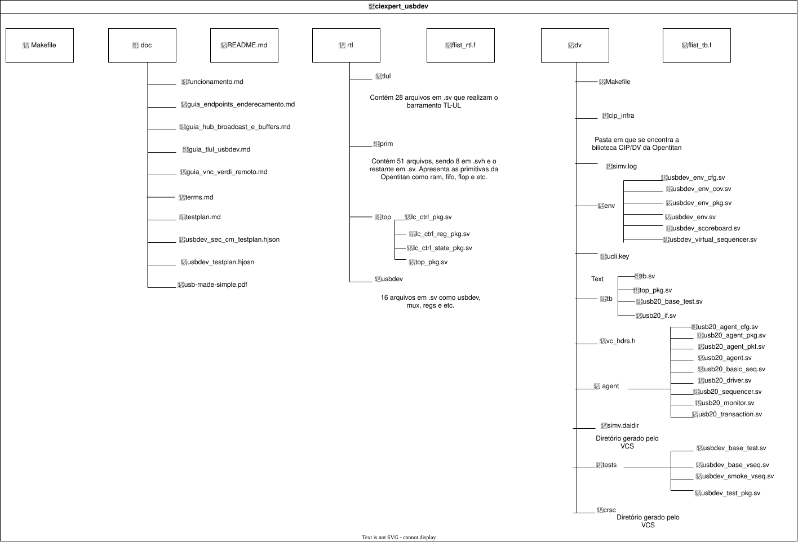

#  Verificação do módulo USB 2.0 do projeto OpenTitan
Por Andreza Carneiro, João Navarro e Manoela Terra.

https://opentitan.org/book/hw/ip/usbdev/index.html
## Estrutura do repositório

```
ciexpert_usbdev/
├── README.md
├── flist_rtl.f            # RTL do usbdev + prim/tlul/top (ordem de dependência)
├── flist_tb.f             # CIP lib + agente + env + testes + tb
├── Makefile               # Makefile antigo da raiz (use o de dv/)
├── doc/                   # testplan, guias (TL-UL, endpoints, buffers, Verdi/VNC)
├── rtl/
│   ├── usbdev/            # DUT: usbdev.sv, usbdev_usbif, usb_fs_rx/tx, PEs, regs
│   ├── prim/              # primitivas OpenTitan (fifo, flop, secded, ram...)
│   ├── tlul/              # barramento TL-UL
│   └── top/               # top_pkg, lc_ctrl_pkg
└── dv/
    ├── Makefile           # fluxo de compilação/simulação (VCS)
    ├── cip_infra/         # biblioteca CIP / DV do OpenTitan
    ├── agent/             # agente USB 2.0 do projeto
    │   ├── usb20_agent_pkg.sv
    │   ├── usb_transaction.sv   # item: pid, addr, endp
    │   ├── usb20_agent_cfg.sv
    │   ├── usb20_sequencer.sv
    │   ├── usb20_driver.sv
    │   ├── usb20_monitor.sv
    │   ├── usb20_agent.sv
    │   └── usb20_basic_seq.sv
    ├── env/
    │   ├── usbdev_env_pkg.sv    # inclui env + vseqs
    │   ├── usbdev_env_cfg.sv
    │   ├── usbdev_env_cov.sv
    │   ├── usbdev_scoreboard.sv
    │   ├── usbdev_virtual_sequencer.sv
    │   └── usbdev_env.sv
    ├── tests/
    │   ├── usbdev_test_pkg.sv
    │   ├── usbdev_base_test.sv
    │   ├── usbdev_base_vseq.sv
    │   └── usbdev_smoke_vseq.sv
    └── tb/
        ├── tb.sv          # top: DUT + interfaces + run_test()
        └── usb20_if.sv    # interface física USB (D+/D-, sense, enables)
```

`dv/tb/top_pkg.sv` e `dv/tb/usb20_base_test.sv` são da estrutura inicial e não
estão no `flist_tb.f`.

---


## Diagrama do ambiente

```
 usbdev_base_test  (cip_base_test)
 │   +UVM_TEST_SEQ=usbdev_smoke_vseq
 │
 └── usbdev_env  (cip_base_env)
     │
     ├── usbdev_env_cfg ──── RAL (usbdev_reg_block), usb20_agent_cfg
     ├── usbdev_env_cov
     ├── usbdev_virtual_sequencer ─────────────┐ usb20_sequencer_h
     │      ▲  usbdev_smoke_vseq               │
     │      │   └─ usb20_basic_seq ────────────┤
     ├── m_tl_agent (CIP) ───────────┐         │
     ├── alert agents (CIP)          │         │
     ├── usbdev_scoreboard           │         │
     │                               │         │
     └── m_usb20_agent (projeto)     │         │
         ├── usb20_sequencer ◄───────┼─────────┘
         ├── usb20_driver            │
         └── usb20_monitor           │
               │                     │
 ──────────────┼─────────────────────┼──────────────────────────  tb.sv
               │ usb20_if            │ tl_if        clk_rst_if (48 MHz)
               │ (D+, D-, sense)     │ (TL-UL)      clk_aon   (~200 kHz)
               ▼                     ▼              intr_if, alert_if
          ┌──────────────────────────────────────┐
          │              usbdev (DUT)            │
          │  usbdev_reg_top · usbdev_usbif ·     │
          │  usb_fs_nb_pe (rx/tx, in/out PE)     │
          └──────────────────────────────────────┘
```
