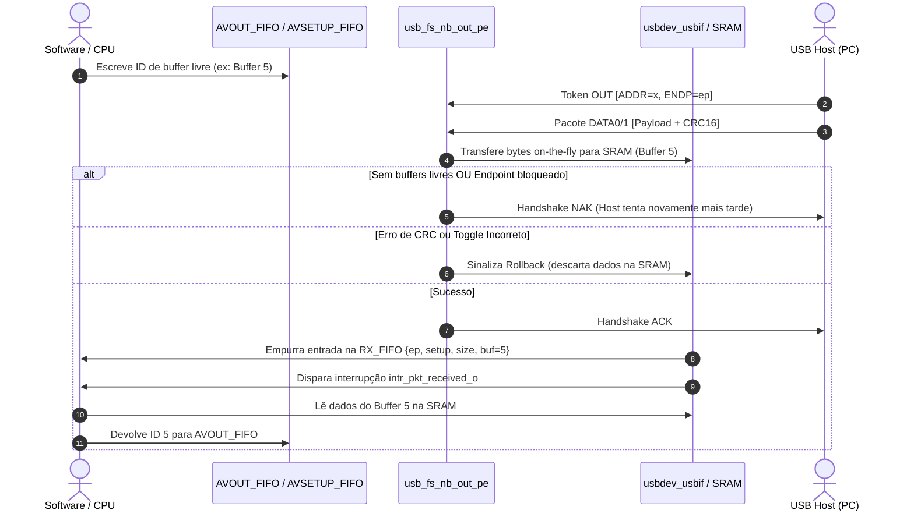
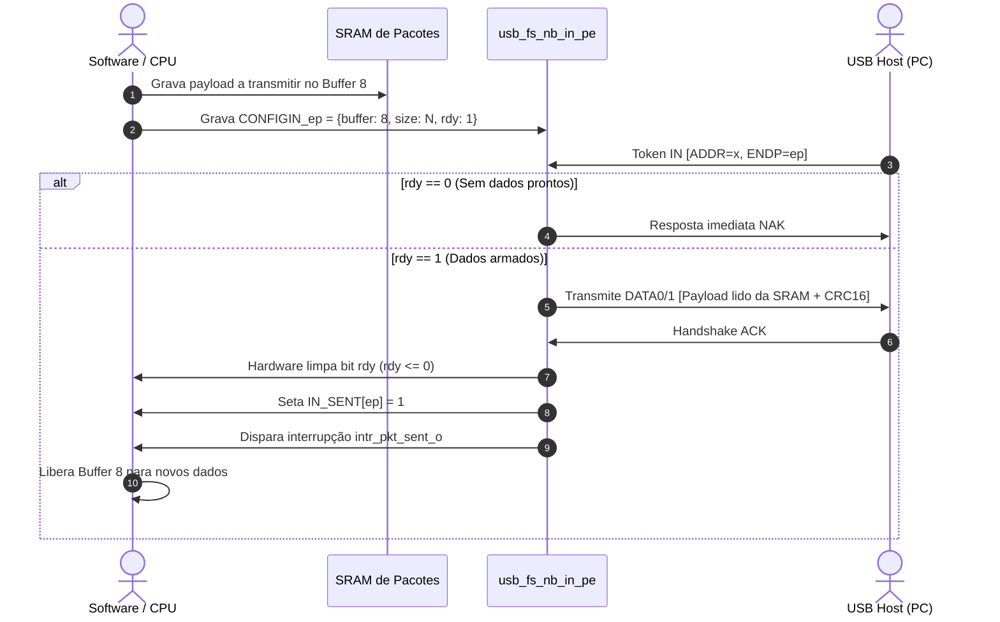

# Guia de Endpoints, Endereçamento e Fluxo de Protocolo no USB 2.0 (OpenTitan `usbdev`)

Este documento serve como referência técnica detalhada sobre o funcionamento conceitual e a implementação em silício/RTL dos **Endpoints**, do **Endereçamento Dinâmico** e do **Fluxo de Transações** do controlador USB 2.0 Full-Speed (`usbdev`) da OpenTitan no projeto **`ciexpert_usbdev`**.

---

## 1. O que é e o que NÃO é um Endpoint?

### A Desmistificação
* **Não é uma porta física nem um conector:** O conector USB possui apenas duas linhas de sinal compartilhado ($D^+$ e $D^-$).
* **Não é um canal exclusivo no cabo:** Todos os pacotes de todos os dispositivos e endpoints trafegam pelo mesmo par de fios diferenciais em modo *half-duplex*.
* **O que ele realmente é:** Um endpoint é um **endereço lógico** mapeado para uma estrutura de controle e buffer de memória (FIFO/SRAM) dentro do controlador periférico. Funciona como uma **"caixa postal" ou "gaveta numerada"** interna do chip.

### A Analogia do Prédio e Apartamento
Para o Host (PC) dialogar com qualquer função do periférico, o endereço completo no cabo é uma tupla composta por três identificadores:

$$\text{Canal Lógico (Pipe)} = (\mathbf{Device\ Address},\ \mathbf{Endpoint\ Number},\ \mathbf{Direção})$$

| Elemento | Analogia | Descrição no Protocolo |
| :--- | :--- | :--- |
| **Device Address** | **Número do Prédio** | Endereço de 7 bits (`0` a `127`) atribuído dinamicamente pelo Host durante a conexão. |
| **Endpoint Number** | **Número do Apartamento** | Endereço interno de 4 bits (`0` a `15` na norma; `0` a `11` no OpenTitan). |
| **Direção (IN / OUT)**| **Entrada / Saída** | Relativa ao Host: **`IN`** = periférico envia ao Host; **`OUT`** = Host envia ao periférico. |

> **Por que múltiplos dispositivos podem ter o `EP1` sem conflito?**  
> Porque a carta não é endereçada apenas para o *"Apartamento 1"*; ela é endereçada para o *"Prédio 2, Apartamento 1 (IN)"*. O Prédio 3, mesmo tendo um Apartamento 1, descarta o pacote no nível de silício.

---

## 2. Endereçamento Dinâmico: Como o Host Batiza os Dispositivos

Diferente de interfaces de rede (Ethernet/Wi-Fi), **nenhum dispositivo USB possui endereço de fábrica gravado no silício**. O Host é o único mestre do barramento e define os endereços em tempo de execução (*Plug-and-Play*).

```
                     BARRAMENTO SERIAL (D+ / D-)
                                 |
    +----------------------------+----------------------------+
    |                                                         |
[ Mouse ]                                                 [ Teclado ]
Endereço Provisório: 0x00                                 (Ainda não conectado)
    |                                                         |
    | 1. Host envia SETUP: SET_ADDRESS(2)                     |
    | 2. Mouse responde ACK e grava ADDR = 2                  |
    v                                                         v
[ Mouse (ADDR = 2) ]                                      [ Teclado Plugado! ]
Atende apenas por ADDR = 2                                Acorda em ADDR = 0x00
    |                                                         |
    | (Mouse ignora pacotes para ADDR = 0)                    | 1. Host envia SET_ADDRESS(3)
    |                                                         | 2. Teclado grava ADDR = 3
    v                                                         v
[ Mouse (ADDR = 2) ]                                      [ Teclado (ADDR = 3) ]
EP1 IN lê movimento                                       EP1 IN lê teclas
```

### Regras do Endereçamento
1. **O Endereço Padrão (`ADDR = 0`):** Todo periférico que sofre Reset ou é recém-conectado responde obrigatoriamente no endereço `0x00` até que o Host ordene o contrário.
2. **Enumeração Sequencial:** O Host conecta e enumera **um periférico por vez**, garantindo que nunca existam dois dispositivos disputando o endereço `0x00` simultaneamente.
3. **Filtro no RTL da OpenTitan:**  
   No módulo [`rtl/usbdev/usb_fs_nb_out_pe.sv`](file:///home/jvnavarro/Área%20de%20trabalho/projects/handson/ciexpert_usbdev/rtl/usbdev/usb_fs_nb_out_pe.sv#L134-L139), o hardware só aceita o pacote se o campo `rx_addr_i` for exatamente igual ao configurado no registrador interno `dev_addr_i` (`USBCTRL.DEVICE_ADDRESS`):
   ```systemverilog
   assign token_received =
     rx_pkt_end_i &&
     rx_pkt_valid_i &&
     rx_pid_type == UsbPidTypeToken &&
     rx_addr_i == dev_addr_i; // Filtro estrito de endereço
   ```
4. **Desconexão e Limpeza:**  
   Se o cabo for desconectado ou o Host forçar um *Bus Reset* (linha em SE0 por $> 2.5\,\mu s$), o registrador de endereço é zerado pelo hardware:
   ```systemverilog
   assign clr_devaddr_o = ~connect_en_i | link_reset;
   ```

---

## 3. Alocação de Endpoints: O que é Criado na Conexão?

Ao plugar um periférico, **não são separados endpoints aleatórios**. O único endpoint universalmente garantido no momento zero é o **Endpoint 0**.

### A. O Endpoint 0 (Default Control Pipe)
* **Obrigatório e Universal:** Todo dispositivo USB 2.0 deve implementar o `EP0`.
* **Bidirecional:** Possui uma metade `EP0 OUT` e uma metade `EP0 IN`.
* **Propósito:** Canal exclusivo para controle, enumeração e requisições padrão (`GET_DESCRIPTOR`, `SET_ADDRESS`, `SET_CONFIGURATION`).

### B. Endpoints Adicionais (EP1 a EP11)
São declarados pelo próprio periférico através de seus **Descritores USB** gravados na memória. O Host lê os descritores no `EP0` e descobre quantos endpoints o dispositivo requer.

| Perfil de Dispositivo | Endpoints Declarados | Justificativa de Engenharia |
| :--- | :--- | :--- |
| **Mouse Simples** | • `EP0` (Controle bidirecional)<br>• `EP1 IN` (Interrupt) | O mouse apenas envia coordenadas para o PC. Não necessita de canal OUT. |
| **Teclado** | • `EP0` (Controle bidirecional)<br>• `EP1 IN` (Interrupt)<br>• `EP1 OUT` (Interrupt) | `EP1 IN` envia teclas digitadas; `EP1 OUT` recebe comandos para ligar os LEDs (*Caps Lock*, *Num Lock*). |
| **Pendrive (Mass Storage)** | • `EP0` (Controle bidirecional)<br>• `EP1 IN` (Bulk)<br>• `EP2 OUT` (Bulk) | `EP1 IN` transfere blocos lidos da memória para o PC; `EP2 OUT` transfere blocos gravados do PC para o pendrive. |
| **Microfone USB** | • `EP0` (Controle bidirecional)<br>• `EP1 IN` (Isochronous) | Fluxo contínuo e pontual de áudio sem retransmissões. |

---

## 4. Arquitetura de Silício do OpenTitan (`usbdev`)

Muitos controladores convencionais usam FIFOs dedicadas por endpoint, o que consome vasta área de silício. A OpenTitan implementa uma **arquitetura de memória compartilhada** com alocação dinâmica por buffers.

```
+-----------------------------------------------------------------------------------+
|                           SRAM INTERNA DE PACOTES (2 kB)                          |
|  [Buf 0: 64B]  [Buf 1: 64B]  [Buf 2: 64B]  ...  [Buf 30: 64B]  [Buf 31: 64B]     |
+-----------------------------------------+-----------------------------------------+
                                          |
                     +--------------------+--------------------+
                     |                                         |
            DIREÇÃO OUT / SETUP                            DIREÇÃO IN
         (Host grava no Periférico)                (Host lê do Periférico)
                     |                                         |
        +------------+------------+                            |
        |                         |                            |
  [ AVOUT_FIFO ]           [ AVSETUP_FIFO ]           [ CONFIGIN_0 .. 11 ]
   Pool de IDs              Pool exclusivo             Registrador por EP:
   livres para OUT          para pacotes SETUP         {buffer, size, rdy, pend}
        \                         /                            |
         \                       /                             v
      Recepção On-the-fly na SRAM                 Leitura On-the-fly da SRAM
                     |                                         |
                     v                                         v
              [ RX_FIFO ]                              Serial D+ / D-
         {ep, setup, size, buf_id}                   Gera interrupção
                     |                                 intr_pkt_sent_o
                     v
         Gera interrupção
         intr_pkt_received_o
```

### Características Centrais da Arquitetura
1. **Memória de 2 kB (512 palavras x 32 bits):**
   - Dividida em **32 buffers de 64 bytes** (tamanho máximo de pacote Full-Speed).
   - Mapeada no barramento TileLink (TL-UL) em `0x800`. O processador lê e escreve diretamente como memória RAM.
2. **Recepção Gerenciada por Pools (FIFOs de Hardware):**
   - **`AVOUT_FIFO`**: Fila onde o software deposita os IDs de buffers disponíveis para pacotes normais de dados OUT.
   - **`AVSETUP_FIFO`**: Fila de IDs de buffers reservados **exclusivamente para pacotes SETUP**.
   - **`RX_FIFO`**: Fila que registra os pacotes recebidos e confirmados com sucesso (`{ep[3:0], setup, size[6:0], buffer[4:0]}`).
3. **Transmissão Gerenciada por Registradores Dedicados:**
   - Cada um dos 12 endpoints possui seu próprio registrador **`CONFIGIN[0..11]`**.
   - Campos:
     - `buffer[4:0]`: Qual dos 32 buffers da SRAM contém o payload a enviar.
     - `size[6:0]`: Quantidade de bytes válidos (0 a 64 bytes).
     - `rdy`: Bit de armação. Quando `1`, o hardware tem autorização para responder com dados no próximo token IN.

---

## 5. Ciclo de Vida Passo a Passo das Transações no RTL

### A. Transação OUT / SETUP (Host $\rightarrow$ Periférico)
*Módulos: [`usb_fs_nb_out_pe.sv`](file:///home/jvnavarro/Área%20de%20trabalho/projects/handson/ciexpert_usbdev/rtl/usbdev/usb_fs_nb_out_pe.sv) e [`usbdev_usbif.sv`](file:///home/jvnavarro/Área%20de%20trabalho/projects/handson/ciexpert_usbdev/rtl/usbdev/usbdev_usbif.sv)*



#### A Proteção Vital do Pacote SETUP
A especificação USB 2.0 **proíbe responder NAK a um pacote SETUP**. Se o dispositivo der NAK, a comunicação falha irremediavelmente.
A OpenTitan resolve isso com duas travas de silício:
1. **Buffers Separados:** A `AVSETUP_FIFO` só fornece buffers para pacotes de controle SETUP.
2. **Prioridade na `RX_FIFO`:** Se a fila de recepção atingir 7 de 8 posições ocupadas, o hardware **bloqueia e dá NAK em pacotes OUT normais**, garantindo o último slot para um possível `SETUP`.

---

### B. Transação IN (Periférico $\rightarrow$ Host)
*Módulos: [`usb_fs_nb_in_pe.sv`](file:///home/jvnavarro/Área%20de%20trabalho/projects/handson/ciexpert_usbdev/rtl/usbdev/usb_fs_nb_in_pe.sv) e [`usbdev_usbif.sv`](file:///home/jvnavarro/Área%20de%20trabalho/projects/handson/ciexpert_usbdev/rtl/usbdev/usbdev_usbif.sv)*



---

## 6. Mapeamento de Registradores por Endpoint no OpenTitan

| Registrador | Bits / Campos | Função no Nível de Hardware |
| :--- | :--- | :--- |
| **`EP_OUT_ENABLE`** | `[11:0]` (1 bit por EP) | Habilita os endpoints OUT a responder no barramento. |
| **`EP_IN_ENABLE`** | `[11:0]` (1 bit por EP) | Habilita os endpoints IN a responder no barramento. |
| **`RXENABLE_SETUP`**| `[11:0]` (1 bit por EP) | Configura o endpoint para aceitar pacotes SETUP (ativo no `EP0`). |
| **`RXENABLE_OUT`**  | `[11:0]` (1 bit por EP) | Habilita a recepção de dados OUT regulares no endpoint. |
| **`SET_NAK_OUT`**   | `[11:0]` (1 bit por EP) | **Controle automático de fluxo:** Quando ativo, o hardware limpa `RXENABLE_OUT[ep]` após receber um pacote, forçando NAK até o software processar o pacote recebido. |
| **`IN_SENT`**       | `[11:0]` (1 bit por EP) | Flags sinalizando que o pacote IN do endpoint foi entregue e confirmado com ACK pelo Host. |
| **`OUT_STALL`**     | `[11:0]` (1 bit por EP) | Força o hardware a responder handshake `STALL` a tokens OUT. |
| **`IN_STALL`**      | `[11:0]` (1 bit por EP) | Força o hardware a responder handshake `STALL` a tokens IN. |
| **`CONFIGIN[0..11]`**| `{rdy, pend, sending, size[6:0], buffer[4:0]}` | Armação e configuração de transmissão de cada canal IN. |
| **`OUT_DATA_TOGGLE`**| `status[11:0]`, `mask[11:0]` | Estado e controle de alternância de sincronismo `DATA0`/`DATA1` para recepção OUT. |
| **`IN_DATA_TOGGLE`** | `status[11:0]`, `mask[11:0]` | Estado e controle de alternância de sincronismo `DATA0`/`DATA1` para transmissão IN. |

---

## 7. Resumo Prático para Verificação e Testbench (UVM)

Ao criar cenários de teste e sequências UVM no ambiente [`ciexpert_usbdev`](file:///home/jvnavarro/Área%20de%20trabalho/projects/handson/ciexpert_usbdev/README.md):
1. **No lado TL-UL (Software Virtual):**
   * Sempre inicialize e abasteça a `AVSETUP_FIFO` e a `AVOUT_FIFO` com buffers livres antes de esperar tráfego OUT.
   * Ao transmitir via IN, grave os dados na SRAM antes de armar o `CONFIGIN[ep].rdy`.
2. **No lado USB (Host Virtual / Driver):**
   * O driver deve primeiro realizar o ciclo de Reset elétrico ($> 10\text{ ms}$ em hardware real; simulado por pulsos SE0 no UVM).
   * O driver deve direcionar as transações iniciais ao `ADDR = 0` e `ENDP = 0`.
   * Somente após o envio bem-sucedido de `SET_ADDRESS` e `SET_CONFIGURATION` o driver pode direcionar pacotes aos endpoints de aplicação (`EP1` a `EP11`) usando o novo endereço.
