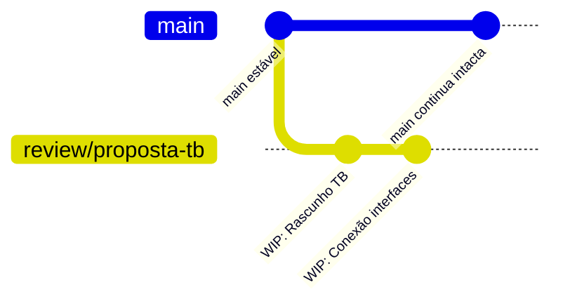
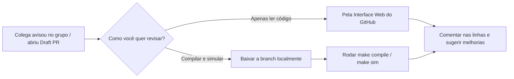

# Guia Prático: Compartilhar Propostas e Rascunhos via Git e Draft PR

Este guia descreve o fluxo de trabalho recomendado para compartilhar alterações, experimentos ou novas abordagens com a equipe no GitHub/GitLab de forma isolada, segura e organizada, sem correr nenhum risco de afetar a branch principal (`main` ou `develop`).

---

## 📌 Visão Geral do Fluxo



O fluxo consiste em **4 etapas principais**:
1. Criar uma **branch isolada** a partir da branch principal atualizada.
2. Fazer o **commit** das alterações locais identificando-as como trabalho em andamento (WIP).
3. Enviar (**push**) essa branch para o repositório remoto.
4. Abrir um **Draft Pull Request** para permitir revisão e comentários linha a linha sem permitir merge acidental.

---

## 🛠️ Passo a Passo Detalhado

### 1. Criar e mudar para uma nova branch

Antes de qualquer coisa, garanta que seu trabalho não fique misturado com a branch principal (`main`). Crie uma nova branch com um nome descritivo. Usar prefixos como `draft/`, `review/` ou `wip/` ajuda a equipe a identificar imediatamente que se trata de uma proposta para visualização:

```bash
# Cria e entra na nova branch
git checkout -b review/minha-proposta
```

*(Ou usando o comando moderno do Git:)*
```bash
git switch -c review/minha-proposta
```

---

### 2. Preparar e fazer o commit

Adicione os arquivos modificados e crie o commit com uma mensagem explicativa. É boa prática usar a sigla **WIP** (*Work In Progress*):

```bash
# 1. Verifica quais arquivos foram modificados
git status

# 2. Adiciona as alterações desejadas para o commit
git add .

# 3. Registra o commit
git commit -m "WIP: Rascunho da funcionalidade X para validação com a equipe"
```

---

### 3. Enviar a branch para o repositório remoto

Envie a branch para o servidor remoto configurando o rastreamento (*upstream* com `-u`):

```bash
git push -u origin review/minha-proposta
```

A partir deste momento:
* A branch `main` do repositório continua **100% intacta e estável**.
* A branch remota já está visível para seus colegas no GitHub/GitLab.
* Qualquer colega pode visualizar os arquivos pela interface web do repositório ou baixá-la localmente para testar:
  ```bash
  git fetch origin
  git checkout review/minha-proposta
  ```

---

### 4. Criar um Draft Pull Request (Altamente Recomendado)

Se o projeto está hospedado no GitHub ou GitLab, o **Draft Pull Request** é a melhor ferramenta para discutir ideias:

1. Acesse o repositório no navegador.
2. O GitHub exibirá uma barra amarela indicando que a branch acabou de receber push. Clique no botão **"Compare & pull request"**.
3. No botão verde de criação do PR, clique na **setinha para baixo** e selecione **"Create Draft Pull Request"**.
4. Clique para confirmar a abertura do Draft.

#### 💡 Principais Vantagens do Draft PR:
* **Bloqueio de Merge:** A interface desabilita o botão de *Merge*, impedindo que alguém incorpore o código por engano antes da hora.
* **Revisão Linha por Linha:** Seus colegas podem abrir a aba *Files changed* e comentar diretamente em linhas específicas do código.
* **Clareza de Intenção:** Fica explícito para todos que aquele código é uma proposta ou pedido de ajuda/feedback, e não uma versão final pronta para produção.

---

## 👥 Ponto de Vista do Resto do Time (Como os Colegas Devem Proceder)

Depois que um integrante da equipe envia a branch (`git push`) e abre o Draft PR, o restante do time tem duas formas de analisar e testar a proposta: **pelo navegador** (revisão de código) ou **no computador/servidor local** (para compilar e rodar simulações).



---

### Opção 1: Revisar diretamente pelo Navegador (GitHub)
*Ideal para discussões conceituais, tirar dúvidas e ver o que mudou de forma rápida.*

1. **Acessar o Pull Request:**
   - Abra a página do repositório no GitHub e vá até a aba **"Pull requests"**.
   - Clique no PR correspondente (que estará marcado com a etiqueta cinza `Draft`).
2. **Examinar as alterações:**
   - Clique na aba **"Files changed"** (Arquivos alterados).
   - O GitHub mostrará o *diff* comparativo (verde = adições, vermelho = remoções).
3. **Fazer comentários linha a linha:**
   - Passe o mouse sobre qualquer linha de código e clique no botão azul **`+`**.
   - Digite sua observação, dúvida ou sugestão.
   - Use o botão **"Start a review"** (para agrupar vários comentários) ou **"Add single comment"**.
4. **Sugerir código alternativo diretamente na interface:**
   - Ao comentar, você pode clicar no ícone de sugestão de código (`Insert a suggestion` ou usar Markdown ` ```suggestion `). Isso permite que o autor aceite a sua sugestão com 1 clique!

---

### Opção 2: Baixar a Branch no Computador Local / Servidor
*Essencial para simulações: permite compilar com VCS, rodar testes e abrir o Verdi na branch do colega.*

#### Passo 1: Salvar o seu trabalho atual (se houver)
Antes de mudar de branch, garanta que suas próprias alterações não se percam:
```bash
# Verifique se você tem arquivos modificados
git status

# Se tiver algo inacabado que não quer commitar agora, use o stash:
git stash
```

#### Passo 2: Baixar as novidades do repositório remoto
O Git local precisa ser avisado de que uma nova branch foi criada no servidor:
```bash
git fetch origin
```

#### Passo 3: Mudar para a branch de revisão do colega
```bash
# Cria uma cópia local rastreando a branch remota do colega
git checkout review/minha-proposta
```
*(Ou com o comando moderno: `git switch review/minha-proposta`)*

#### Passo 4: Compilar e testar
Agora que seu diretório de trabalho está com os arquivos da proposta:
```bash
# Exemplo: compilar e simular o testbench da proposta
make compile
make sim TEST=usb20_base_test
```

#### Passo 5: Voltar para o seu trabalho normal
Quando terminar de avaliar a proposta do colega:
```bash
# Volta para a sua branch habitual
git checkout main

# Se você usou o stash no Passo 1, restaure seu trabalho anterior:
git stash pop
```

---

### 📝 Boas Práticas para o Time durante a Revisão

1. **Evite commitar diretamente na branch do colega:**
   - Deixe o autor da proposta fazer os ajustes com base no feedback recebido. Se precisar muito alterar algo no código dele, combine antes.
2. **Seja específico nos comentários:**
   - Em vez de apenas "isso não funciona", aponte a linha e explique: *"Na linha 25, o sinal `rst_ni` está invertido em relação ao que o módulo `usbdev` espera."*
3. **Quando a equipe entrar em consenso:**
   - O autor do PR clica em **"Ready for review"**.
   - O time faz o **Approve** final.
   - O autor (ou responsável) clica em **Merge pull request** para que o código vire o novo padrão na `main`.

---

## 📚 Referências

* Chacon, S., & Straub, B. *Pro Git* (2nd ed.). Apress / Git SCM Documentation (`git-checkout`, `git-push`, `git-branch`).
* GitHub Docs: *Collaborating with pull requests - Proposing changes to your work with pull requests*.
